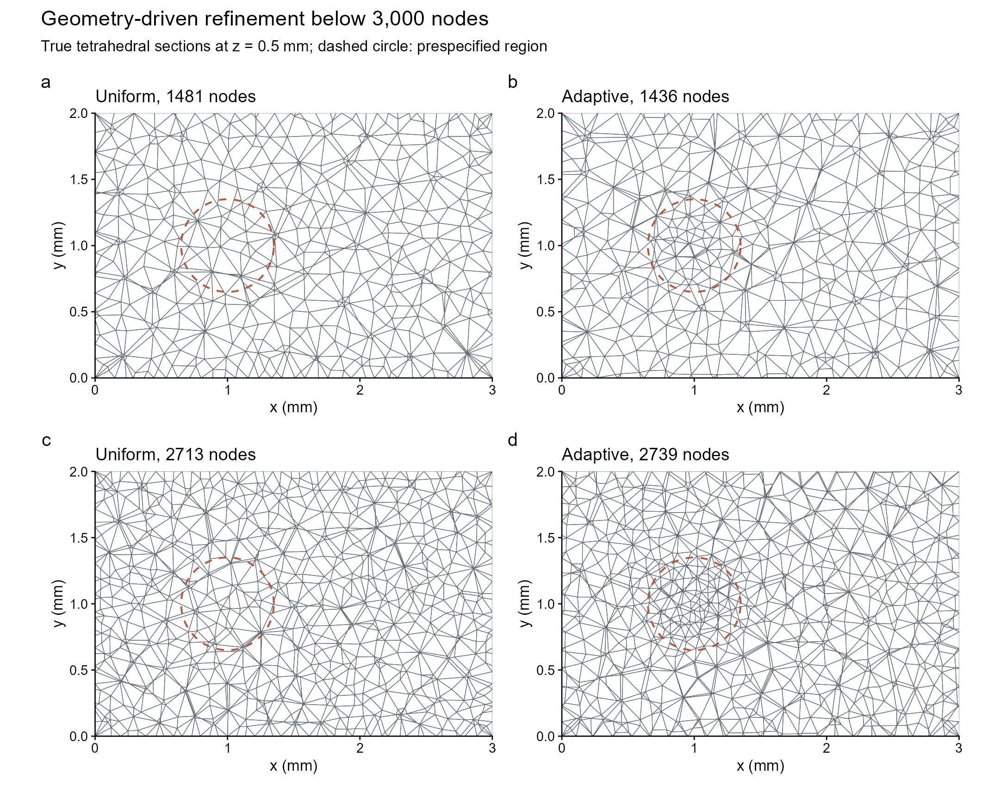

# INLA-only adaptive tetrahedral analysis of stacked slices

This study evaluates a sparse three-dimensional fitting route with fewer than
3,000 mesh nodes. Spatial log precision and negative-binomial (NB) log size
both retain the author's flat objectives. The implementation uses actual
volume tetrahedra, tetrahedral finite elements and R-INLA. It supplies an
executable research prototype; the package's public mesh and score-test APIs
still accept two-dimensional inputs.

## Model and adaptivity

Registered slices contribute observations at physical coordinates `(x, y, z)`.
For linear tetrahedral elements, each observation interpolates at most four
mesh coefficients. The model is `log(mu) = offset + beta + A u`, with sparse
precision `Q(tau) = tau * (kappa^4 C + 2 kappa^2 G + G C^-1 G)`, where `C`
is the lumped mass matrix and `G` is the three-dimensional stiffness matrix.
We fix kappa and estimate the spatial precision multiplier and NB size.
The observation-mean constraint is `(colMeans(A))' u = 0`, imposed directly
with `extraconstr`; no dense null-space projection is constructed. The
proper base precision plus one exact constraint uses `rankdef = 1` in
`generic0`, consistently with the existing package convention and
[INLA's constraint documentation](https://www.r-inla.org/learnmore/docs/reference/f.html).

In three dimensions, operator order alpha = 2 implies Matérn smoothness
nu = 1/2. The nominal range is therefore `rho = 2/kappa`; the pilot uses
kappa = 5 per mm and rho = 0.4 mm. This differs from the alpha = 2,
nu = 1 convention in two dimensions. The dimensions and range transformation
follow the [fmesher Matérn definition](https://inlabru-org.github.io/fmesher/reference/fm_gmrf.html).

Adaptivity is geometric and response-independent in this prototype. Gmsh
generates a graded mesh from a spatial target-size field. Within a synthetic
3 by 2 by 1 mm box, the field refines a prespecified neighbourhood of
`(1, 1, 0.5)`; its smallest target edge size is 45% of the outer target.
A scalar size multiplier is adjusted until the mesh lies below the requested
node budget. Mesh quality is optimized with Netgen and checked for positive
element quality. This is a concrete use of
[Gmsh's background size fields](https://gmsh.info/doc/texinfo/gmsh.html#Mesh-element-sizes).
It is not a residual-driven refinement algorithm. Uniform and adaptive
meshes share a node budget, rather than an exactly equal number of nodes.

The pipeline uses `fmesher::fm_mesh_3d()`, `fm_fem()` and `fm_basis()`, then
passes the resulting sparse Q and A to INLA's `generic0` model. Current
fmesher 0.8.0 contains these 3D methods, so this implementation does not need
the older inlamesh3d overrides. The
[mesh constructor](https://inlabru-org.github.io/fmesher/reference/fm_mesh_3d.html)
accepts four vertex indices per tetrahedron, and the
[FEM documentation](https://inlabru-org.github.io/fmesher/reference/fm_fem.html)
describes its 3D mass and stiffness matrices.

## Repeated local validation

The fixed observation design contains 10 slices with 3,000 spots each.
Two analytic surfaces are evaluated directly at the observations, so neither
surface is generated from one of the competing meshes. The broad surface
varies across the domain; the focal surface adds a local peak within the
prespecified refinement region. These are surface-recovery scenarios with
known truth, not draws from a fitted mesh prior. Ten independent NB response
vectors are generated per scenario, with size 8, baseline mean 6 and a
shared log-exposure offset. Every mesh receives exactly the same response
vector in a paired comparison: 20 datasets and 80 fits in total.

The formal run uses the package's Gaussian latent approximation and EB
configuration, disables variational correction, and uses one INLA thread.
Both hyperparameters are explicitly assigned
`list(prior="flat", param=numeric(), initial=0, fixed=FALSE)`; fixed-effect
precision is zero. NB size is estimated, not fixed to its generating value.
INLA defines its NB prior on log size, as specified in the
[likelihood documentation](https://inla.r-inla-download.org/r-inla.org/doc/likelihood/nbinomial.pdf).
The interpretation remains the package's
[flat-objective, conditional-estimation convention](inla-flat-prior.md).
In particular, this study assesses point estimation and mesh sensitivity;
it does not use hyperparameter posterior intervals to claim coverage.

All 80 fits completed with INLA mode status zero and finite fitted fields.
The largest observation-mean constraint residual was 4.80e-8. Estimated NB
size ranged from 7.66 to 8.32 across the full experiment.

| Mesh | Nodes | Tetrahedra | Broad fit, median seconds | Focal fit, median seconds | Focal region RMSE, median |
|---|---:|---:|---:|---:|---:|
| Uniform, 1,500 budget | 1,481 | 5,856 | 4.71 | 4.01 | 0.1119 |
| Adaptive, 1,500 budget | 1,436 | 5,821 | 4.91 | 4.20 | 0.0913 |
| Uniform, 2,800 budget | 2,713 | 11,414 | 16.31 | 14.66 | 0.1013 |
| Adaptive, 2,800 budget | 2,739 | 11,880 | 18.48 | 16.79 | 0.0887 |

For the focal surface, adaptive meshing reduced region RMSE in all ten
paired datasets at each budget. The median within-dataset reductions were
18.0% at the 1,500-node budget and 12.2% at the 2,800-node budget. The
corresponding ranges were 13.7–21.0% and 10.6–14.6%. These are paired
percentage changes, rather than ratios of separately computed medians.
Whole-domain RMSE improved by a median of 2.9% and 1.8%, respectively.
The local gain is therefore reproducible in this targeted scenario, while
its effect on whole-domain recovery is smaller.

Increasing the adaptive budget from 1,500 to 2,800 further reduced focal
region RMSE by a median of 3.1%, but increased whole-domain RMSE by 1.3%.
For the broad surface, adaptive versus uniform whole-domain RMSE changed
by only +0.9% and +0.2% at the two budgets. Its region RMSE was lower in
only three and two of ten paired datasets, respectively. Thus the benefit
comes from placing resolution near the focal structure, rather than from
an automatic advantage of nonuniform meshes.

The focal region-versus-background mean contrast was 0.4400 on the log-mean
scale. Median estimates across the four meshes were 0.4350–0.4381. The
adaptive meshes improved local surface recovery without improving this
aggregate contrast. Across the two adaptive resolutions, median fitted-field
correlations were 0.9935 for the broad surface and 0.9959 for the focal surface.
Mesh choice should therefore be checked against the intended scientific
output, as well as against field recovery.

Mesh generation, including budget search and quality optimization, took
0.68–2.68 seconds once per mesh. FEM construction took 0.05–0.19 seconds and
the 30,000-location sparse projector took 0.11–0.41 seconds. Native INLA
`Running` time dominated fitting, with medians of about 3.6–4.2 seconds for
the smaller meshes and 14.9–17.2 seconds for the larger meshes. `Running`
includes optimization, likelihood and sparse numerical work; the pilot
does not separately time each internal factorization. Summed process memory
samples covered 79 task labels, with a maximum RSS of 709 MiB and maximum
private allocation of 2,807 MiB. These are sampled process-tree values,
not exact peaks or 40-gene joint-model memory requirements.

The four meshes pass independent checks for tetrahedron volume, an analytic
unit-tetrahedron stiffness matrix, barycentric interpolation, affine-function
reproduction, and the three-dimensional Matérn precision normalization.
Each full mesh covers volume 6 mm^3. Interpolation row-sum and affine errors
are below 1e-14, with exactly 120,000 nonzero interpolation entries for
30,000 observations. All precision matrices pass sparse Cholesky.



The figure shows all tetrahedra intersecting z = 0.5 mm, using common axes.
The dashed circle identifies the prespecified region. These are sections of
three-dimensional volume meshes, not meshes obtained by triangulating each
slice separately. Figure source coordinates, vector exports and the figure
QA record are included with the results.

## Implications for the stacked-slice implementation

We recommend using a coarse physical mesh as the starting point and a mesh
near the 3,000-node budget as a refinement comparison. Nodes should be
allocated according to the geometry and the shortest spatial scale needed
for the target analysis. The number of spots or slices need not equal the
number of mesh nodes or node layers. A useful stopping check compares the
fitted fields and the actual region or pathway estimand between meshes;
small changes in an estimated spatial precision alone are insufficient.

The 3D package route should retain raw sparse A, Q and the constraint vector
through model setup and fitting. The existing two-dimensional adapter builds
`A %*% Z` and a projected Q to share mgcv geometry; directly extending that
adapter to three coordinates would reintroduce dense observation-by-node
storage. The raw INLA fitting mechanism can instead be reused through a
separate tetrahedral setup path. Geometry and fixed-kappa Q should be built
once and reused across genes. This pilot omits predictor marginals and
retained joint configurations, and reconstructs the fitted field as `A u`.
Downstream score tests require their own covariance and constraint audit.

For real stacked slices, input coordinates must first share physical units
and a registration system. Slice spacing, missing sections, tissue holes
and disconnected components determine the volume boundary. A constrained
volume mesher should preserve those boundaries; an unconstrained Delaunay
convex hull can connect tissue across empty regions. Any z-axis rescaling
must represent a stated anisotropy choice, and any outer buffer belongs in
the node budget. The present box experiment does not validate an anatomical
surface reconstruction or a response-driven adaptive mesh selector.

The timing unit here is one gene with 30,000 observations. A pathway model
with 40 fields and shared hyperparameters is a different joint fit. Forty
independent fits with separately estimated hyperparameters are not an
equivalent computational replacement. Likewise, this pilot does not claim
timings for 300,000 or one million observations, or validate 3D WGCNA/pair
tests. The former multi-computer benchmark's source was unavailable in the
fetched main branch; this is an independent local validation, not a claimed
reproduction of that source.

## Reproduction and provenance

Run from the canonical package checkout. R 4.6.1, INLA 26.06.08, fmesher 0.8.0
and Gmsh 4.15.2 were used. The mesher uses one thread and a fixed Gmsh seed.
The R script records its session information and saves its complete input,
prepared geometry and per-fit fields under `artifacts/inla3d/eb/`.

```text
python -m pip install gmsh==4.15.2 numpy psutil
python inst/benchmarks/inla3d-mesh.py
Rscript inst/benchmarks/inla3d-geometry-check.R
Rscript inst/benchmarks/inla3d-validation.R 10
Rscript inst/benchmarks/inla3d-summarize.R
Rscript inst/benchmarks/inla3d-mesh-figure.R
```

The monitor is optional for statistical reproduction: while R is running,
`python inst/benchmarks/inla3d-monitor.py <R-process-PID>` samples the R
process and its children once per second. On Windows, choose the actual
`bin/x64/Rscript.exe` child, not an unrelated R session. Memory figures are
sampled maxima of summed process RSS and private bytes, not exact peaks;
sampling began during the first replicate, so initial tasks have incomplete
memory coverage. Small numerical tables, paired contrasts and input/source
hashes are versioned under `inst/validation/inla3d/`. The large raw outputs
and logs stay under the ignored artifact directory.

The exact four meshes are also versioned in `inst/validation/inla3d/meshes/`.
To reproduce the fits without remeshing, create `artifacts/inla3d/mesh/`, copy
those eight CSV files there, and copy `mesh-manifest.csv` there as
`manifest.csv`; then begin with the R commands above. This avoids dependence
on cross-platform mesher reproducibility. Regenerating the meshes remains
available to investigate the budget-selection procedure itself.

On this Windows host, installing the Gmsh wheel with `pip --target` did not
place its data/lib DLL on the import search path. The isolated installation
was completed by extracting the wheel's `gmsh-4.15.dll` alongside `gmsh.py`.
The required INLA switch is `control.inla$control.vb$enable = FALSE`;
an earlier `vb` spelling was rejected. Formal runs turn warnings into errors.
The initial failed trial and eight exploratory CCD fits remain in
`artifacts/inla3d/`, outside the completed EB result set. CCD results are
not pooled into the formal comparisons.
